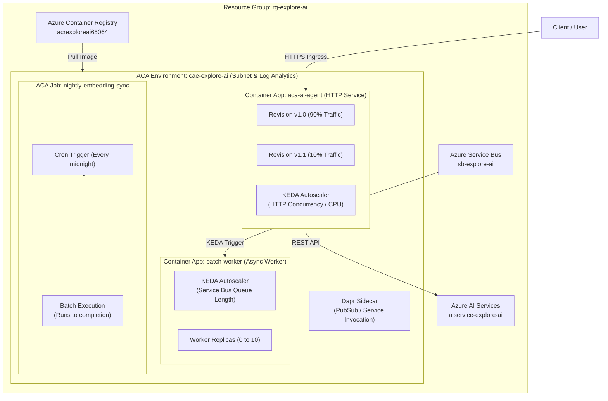

# Azure Container Apps (ACA): The Definitive Master Guide for Engineers

Welcome to the comprehensive reference and operational manual for **Azure Container Apps (ACA)**. This guide covers ACA's complete feature set, architecture, scaling mechanisms, microservice integration, deployment workflows, pros/cons, and a live working deployment walkthrough.

---

## Table of Contents
1. [Overview & What is Azure Container Apps?](#1-overview--what-is-azure-container-apps)
2. [Deep Dive: Architecture & Core Capabilities](#2-deep-dive-architecture--core-capabilities)
   - [A. Environment Boundary (`cae-explore-ai`)](#a-environment-boundary-cae-explore-ai)
   - [B. Container Apps (Services) vs. ACA Jobs](#b-container-apps-services-vs-aca-jobs)
   - [C. Revisions, Traffic Splitting & Blue/Green Deployments](#c-revisions-traffic-splitting--bluegreen-deployments)
   - [D. KEDA Autoscaling (HTTP, Queue, CPU, Cron)](#d-keda-autoscaling-http-queue-cpu-cron)
   - [E. Built-in Dapr Integration (Distributed Application Runtime)](#e-built-in-dapr-integration-distributed-application-runtime)
   - [F. Managed Identity, Secrets & Key Vault](#f-managed-identity-secrets--key-vault)
   - [G. Storage & Networking](#g-storage--networking)
3. [ACA vs. AKS vs. Azure Functions vs. Azure App Service](#3-aca-vs-aks-vs-azure-functions-vs-azure-app-service)
4. [Deployment Workflows: How to Deploy to ACA](#4-deployment-workflows-how-to-deploy-to-aca)
5. [Pros & Cons Matrix](#5-pros--cons-matrix)
6. [Live Working Implementation: Step-by-Step Walkthrough](#6-live-working-implementation-step-by-step-walkthrough)
7. [Operational Cheat Sheet & Useful CLI Commands](#7-operational-cheat-sheet--useful-cli-commands)

---

## 1. Overview & What is Azure Container Apps?

**Azure Container Apps (ACA)** is a fully managed, serverless container platform designed for executing microservices, background jobs, and cloud-native web applications.

Behind the scenes, ACA is built on top of enterprise-grade open-source technologies:
- **Kubernetes (AKS)**: Provides robust container orchestration without exposing cluster nodes or control plane management.
- **KEDA (Kubernetes Event-driven Autoscaling)**: Powers event-driven scaling from 0 to hundreds of instances.
- **Dapr (Distributed Application Runtime)**: Simplifies microservice communication, pub/sub, state management, and secrets.
- **Envoy Proxy**: Handles ingress routing, TLS termination, traffic splitting, and mutual TLS (mTLS) encryption.

### Why Use ACA for AI & Microservices?
AI workloads require flexible runtime environments, custom dependencies (PyTorch, Transformers, LangChain, OpenCV), auto-scaling capability, and low operating costs. ACA allows you to package any language, framework, or binary into a Docker container and run it serverlessly.

---

## 2. Deep Dive: Architecture & Core Capabilities



### A. Environment Boundary (`cae-explore-ai`)
- **Isolation**: A Container Apps Environment acts as a secure boundary enclosing all deployed apps and jobs.
- **VNet Integration**: Can be integrated into a custom Virtual Network (VNet) in either `External` or `Internal` mode.
- **Internal Microservice DNS**: Apps within the same environment communicate over private internal DNS names (`http://app-name.internal.cae-explore-ai...`) with automatic mTLS encryption.
- **Shared Telemetry**: Centralized logging sending stdout/stderr and metrics to Azure Log Analytics.

### B. Container Apps (Services) vs. ACA Jobs

| Feature | Container Apps (Services) | ACA Jobs |
| :--- | :--- | :--- |
| **Lifecycle** | Long-running, continuously listening for HTTP, gRPC, or Queue events | Ephemeral; runs to completion and terminates |
| **Trigger Types** | HTTP requests, TCP traffic, KEDA queue/event scaling, CPU/Memory rules | Scheduled (Cron), Event-driven (Service Bus), Manual API trigger |
| **Ideal For** | FastAPI endpoints, LangChain REST servers, Streamlit dashboards, Celery workers | Model fine-tuning, nightly embedding updates, batch ETL scripts |

### C. Revisions, Traffic Splitting & Blue/Green Deployments
- **Immutable Snapshots**: Every deployment or environment variable modification generates a new **Revision** (e.g. `aca-ai-agent--v1` -> `aca-ai-agent--v2`).
- **Single vs. Multiple Revision Mode**:
  - *Single Mode*: 100% of traffic routes automatically to the latest revision.
  - *Multiple Mode*: Split traffic across multiple revisions by percentage (e.g., 90% to `v1.0`, 10% to `v2.0` for A/B prompt testing).
- **Instant Rollback**: If `v2.0` throws errors, route 100% back to `v1.0` in seconds without rebuilding code.

### D. KEDA Autoscaling (HTTP, Queue, CPU, Cron)
- **Scale to Zero (`minReplicas = 0`)**: Drops compute to zero instances when idle, incurring **$0 cost**.
- **Supported Scale Triggers**:
  1. **HTTP Concurrency**: Scale up when active concurrent requests exceed a target (e.g., 10 concurrent requests/pod).
  2. **Azure Service Bus / Storage Queue**: Scale up workers based on unprocessed message depth.
  3. **CPU & Memory**: Scale out when CPU utilization exceeds a target percentage (e.g. 80%).
  4. **Cron Schedule**: Pre-scale instances ahead of expected high traffic.

### E. Built-in Dapr Integration (Distributed Application Runtime)
ACA natively injects Dapr sidecars into your containers. Dapr provides standardized building blocks:
- **Service Invocation**: Call other microservices securely using simple URLs (`http://localhost:3500/v1.0/invoke/other-app/method/analyze`).
- **Pub/Sub Messaging**: Publish and subscribe to events across Service Bus, Redis, or Kafka without changing Python code.
- **State Management**: Save and retrieve conversation state or session memory using key-value stores.

### F. Managed Identity, Secrets & Key Vault
- **Passwordless Security**: Enable System-Assigned or User-Assigned Managed Identity (`az containerapp identity assign`).
- **Secret Management**: Store sensitive tokens in ACA Secrets (backed by Key Vault) and reference them as container environment variables.
- **ACR Authentication**: Pull private Docker images from `acrexploreai65064.azurecr.io` seamlessly using Managed Identity.

### G. Storage & Networking
- **Ingress**: Supports External (public internet) or Internal (VNet only) HTTP/gRPC ingress with custom domains and free managed SSL certificates.
- **Volumes**: Mount ephemeral storage, Azure Files shares (SMB/NFS) for shared model caches, or secrets as volume mounts.

---

## 3. ACA vs. AKS vs. Azure Functions vs. Azure App Service

| Dimension | Azure Container Apps (ACA) | Azure Kubernetes Service (AKS) | Azure Functions | Azure App Service |
| :--- | :--- | :--- | :--- | :--- |
| **Management Overhead** | **Serverless** (Zero k8s management) | High (Manage nodes, upgrades, Helm) | **Serverless** (Zero infra) | Low (PaaS platform management) |
| **Workload Flexibility** | Any Docker container | Any Docker container | Function snippets / code | Containers or web code |
| **Scaling Capability** | KEDA (Scale to 0, HTTP, Queue, Cron) | HPA / KEDA / Cluster Autoscaler | Scale to 0 (Event driven) | Manual / Autoscale on CPU |
| **Microservices & Dapr** | Native Dapr sidecars built-in | Self-installed Dapr operator | Limited | Limited |
| **Cost Model** | Pay per vCPU/GB second (Scales to $0) | Pay for VM nodes 24/7 | Pay per execution | Pay for App Service Plan 24/7 |
| **Best Use Case** | Microservices, AI Agents, APIs, Jobs | Large enterprise K8s clusters | Lightweight event handlers | Legacy monolith web apps |

---

## 4. Deployment Workflows: How to Deploy to ACA

ACA supports multiple deployment mechanisms:

### Method 1: Azure CLI + ACR Cloud Build (`az acr build`) *(Recommended)*
No local Docker engine required. Azure builds the container image in the cloud and deploys it immediately to ACA.

```bash
# 1. Build image in ACR
az acr build --registry acrexploreai65064 --image aca-ai-agent:v1.0 .

# 2. Deploy Container App
az containerapp create \
  --name aca-ai-agent \
  --resource-group rg-explore-ai \
  --environment cae-explore-ai \
  --image acrexploreai65064.azurecr.io/aca-ai-agent:v1.0 \
  --target-port 8000 \
  --ingress external \
  --min-replicas 1 \
  --max-replicas 5
```

### Method 2: Infrastructure as Code (Bicep / Terraform)
Bicep template snippet for ACA:
```bicep
resource containerApp 'Microsoft.App/containerApps@2023-05-01' = {
  name: 'aca-ai-agent'
  location: 'eastus'
  properties: {
    managedEnvironmentId: resourceId('Microsoft.App/managedEnvironments', 'cae-explore-ai')
    configuration: {
      ingress: {
        external: true
        targetPort: 8000
      }
    }
    template: {
      containers: [
        {
          name: 'ai-agent'
          image: 'acrexploreai65064.azurecr.io/aca-ai-agent:v1.0'
          resources: { cpu: json('0.5'), memory: '1.0Gi' }
        }
      ]
      scale: { minReplicas: 1, maxReplicas: 5 }
    }
  }
}
```

### Method 3: GitHub Actions CI/CD Pipeline
Continuous deployment workflow automatically triggered on Git push:
```yaml
name: Deploy to Azure Container Apps
on:
  push:
    branches: [ main ]

jobs:
  build-and-deploy:
    runs-on: ubuntu-latest
    steps:
    - uses: actions/checkout@v3
    - uses: azure/login@v1
      with:
        creds: ${{ secrets.AZURE_CREDENTIALS }}
    - run: az acr build --registry acrexploreai65064 --image aca-ai-agent:${{ github.sha }} .
    - run: |
        az containerapp update \
          --name aca-ai-agent \
          --resource-group rg-explore-ai \
          --image acrexploreai65064.azurecr.io/aca-ai-agent:${{ github.sha }}
```

---

## 5. Pros & Cons Matrix

### Pros
1. **Zero Kubernetes Management**: Full container orchestration without handling k8s upgrades, worker nodes, or control plane costs.
2. **True Scale-to-Zero**: Eliminates compute costs during idle hours (`minReplicas = 0`).
3. **Built-in KEDA & Dapr**: Enterprise auto-scaling and microservice patterns built into the runtime.
4. **Cloud Container Builds**: Deploy custom apps using `az acr build` without running local Docker Desktop.
5. **Traffic Splitting**: Instant canary rollouts and instant zero-downtime rollbacks across revisions.

### Cons
1. **Cold Start Delay**: Scaling from 0 to 1 instance incurs a 5–15 second startup latency (mitigated by setting `minReplicas = 1`).
2. **GPU Model Limits**: Serving massive 70B+ LLM models locally in-container is constrained; large models belong on Azure AI Foundry / Azure ML endpoints.
3. **Execution Limits on Jobs**: Ephemeral jobs have maximum execution limits (configurable up to hours).

---

## 6. Live Working Implementation: Step-by-Step Walkthrough

Below is the complete implementation of a production-ready **FastAPI AI Microservice** deployed live into your `cae-explore-ai` environment in `rg-explore-ai`.

### Step 1: Microservice Code Structure
The microservice is created in directory [`aca_demo`](file:///c:/Users/2869026/Desktop/up/aca_demo):

#### `main.py` (FastAPI Server)
```python
from fastapi import FastAPI, HTTPException
from pydantic import BaseModel
import os
import socket
import datetime

app = FastAPI(
    title="Azure Container Apps AI Microservice",
    description="Live AI Agent Microservice running on ACA Environment cae-explore-ai",
    version="1.0.0"
)

class SentimentRequest(BaseModel):
    text: str

class SentimentResponse(BaseModel):
    text: str
    sentiment: str
    confidence: float
    processed_by: str
    timestamp: str

@app.get("/")
def read_root():
    return {
        "status": "online",
        "service": "ACA AI Microservice Demo",
        "hostname": socket.gethostname(),
        "environment": os.getenv("CONTAINER_APP_ENV", "cae-explore-ai"),
        "timestamp": datetime.datetime.utcnow().isoformat()
    }

@app.get("/health")
def health_check():
    return {"status": "healthy", "uptime": "ok"}

@app.post("/ai/analyze", response_model=SentimentResponse)
def analyze_sentiment(request: SentimentRequest):
    if not request.text.strip():
        raise HTTPException(status_code=400, detail="Text cannot be empty")
    
    # Simulated AI Model Processing
    text_lower = request.text.lower()
    if any(word in text_lower for word in ["great", "excellent", "awesome", "good", "love"]):
        sentiment = "Positive"
        confidence = 0.95
    elif any(word in text_lower for word in ["bad", "poor", "terrible", "slow", "error"]):
        sentiment = "Negative"
        confidence = 0.91
    else:
        sentiment = "Neutral"
        confidence = 0.78

    return SentimentResponse(
        text=request.text,
        sentiment=sentiment,
        confidence=confidence,
        processed_by=f"ACA Replica ({socket.gethostname()})",
        timestamp=datetime.datetime.utcnow().isoformat()
    )
```

#### `Dockerfile`
```dockerfile
FROM python:3.11-slim
WORKDIR /app
COPY requirements.txt .
RUN pip install --no-cache-dir -r requirements.txt
COPY . .
EXPOSE 8000
CMD ["uvicorn", "main:app", "--host", "0.0.0.0", "--port", "8000"]
```

---

### Live Deployment Verification Steps

#### Step 2: Build Image in Cloud ACR
```bash
az acr build --registry acrexploreai65064 --image aca-ai-agent:v1.0 c:\Users\2869026\Desktop\up\aca_demo
```

#### Step 3: Deploy Live to Azure Container Apps
```bash
az containerapp create \
  --name aca-ai-agent \
  --resource-group rg-explore-ai \
  --environment cae-explore-ai \
  --image acrexploreai65064.azurecr.io/aca-ai-agent:v1.0 \
  --target-port 8000 \
  --ingress external \
  --min-replicas 1 \
  --max-replicas 5
```

#### Step 4: Live HTTP Endpoint Verification
- **Health Check Endpoint**: `GET https://aca-ai-agent.yellowwater-c3bd8780.eastus.azurecontainerapps.io/health`
- **AI Sentiment Analysis Endpoint**: `POST https://aca-ai-agent.yellowwater-c3bd8780.eastus.azurecontainerapps.io/ai/analyze`

---

## 7. Operational Cheat Sheet & Useful CLI Commands

| Command Task | Azure CLI Command |
| :--- | :--- |
| **List Container Apps** | `az containerapp list -g rg-explore-ai --output table` |
| **Show App Details** | `az containerapp show --name aca-ai-agent -g rg-explore-ai` |
| **List Active Revisions** | `az containerapp revision list --name aca-ai-agent -g rg-explore-ai --output table` |
| **Stream Live Logs** | `az containerapp logs show --name aca-ai-agent -g rg-explore-ai --follow` |
| **Set Min/Max Replicas** | `az containerapp update --name aca-ai-agent -g rg-explore-ai --min-replicas 1 --max-replicas 5` |
| **Split Traffic (Canary)** | `az containerapp ingress traffic set --name aca-ai-agent -g rg-explore-ai --revision-weight LATEST=20 v1=80` |
| **Restart Container App** | `az containerapp revision restart --name aca-ai-agent -g rg-explore-ai --revision <revision-name>` |

---

> 📖 **Interactive Feature Testing Guide**: For step-by-step terminal commands to test every ACA feature live (Scale-to-Zero, Warm Replicas, KEDA Autoscaling, Traffic Splitting, ACA Jobs, Logs, Managed Identity) on your active app `aca-ai-agent`, see [`aca_live_testing_guide.md`](file:///c:/Users/2869026/Desktop/up/aca_live_testing_guide.md).

