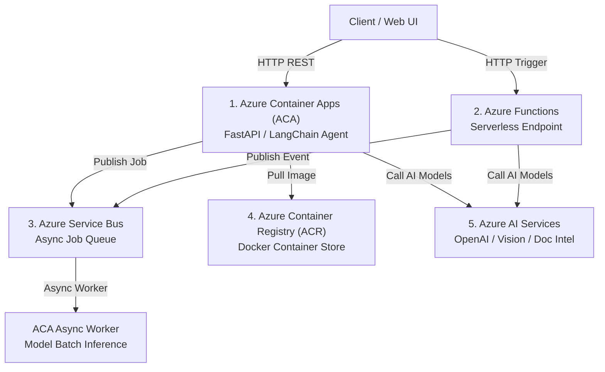
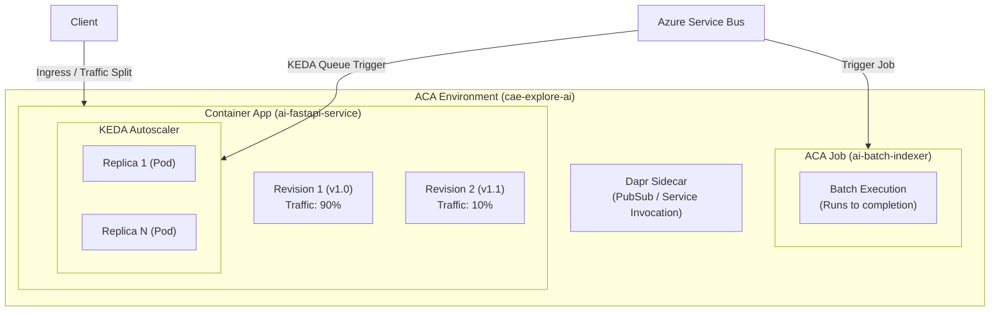

# Azure Microservices Guide for AI Engineers: Use Cases, Pros & Cons

This guide breaks down each core Azure microservice pattern provisioned in your `rg-explore-ai` environment, explaining **When to use**, **Pros & Cons**, and **Hands-on exploration commands**.

---



---

## 1. Azure Container Apps (ACA) — Deep Dive (`cae-explore-ai`)

### What It Is
Azure Container Apps is a serverless container platform designed for microservices and cloud-native applications. Built on top of **Kubernetes (AKS)**, **KEDA (Kubernetes Event-driven Autoscaling)**, **Dapr (Distributed Application Runtime)**, and **Envoy Proxy**, ACA abstracts away all Kubernetes cluster management (nodes, control plane, ingress controllers, pod specs) while delivering full container flexibility.

---

### Core Architecture & Building Blocks



1. **Container App Environment (`cae-explore-ai`)**:
   - The secure boundary enclosing your microservices.
   - Shared Virtual Network (VNet), subnet configuration, and unified Log Analytics workspace.
   - Microservices within the same environment can communicate privately using internal DNS name resolution without passing over the public internet.

2. **Container Apps vs. ACA Jobs**:
   - **Container Apps (Services)**: Always-on or HTTP/Event-triggered services that continuously listen for requests (e.g. FastAPI REST APIs, LangChain agents, Streamlit dashboards).
   - **Container App Jobs**: Task-based executions that run to completion and terminate (e.g., nightly vector embedding synchronization, model evaluation scripts, or bulk dataset ingestion).

3. **Revisions (Immutable Snapshots)**:
   - Every time you change container code, environment variables, or resource specs, ACA creates an **immutable Revision**.
   - Enables **Zero-Downtime deployments**, instant rollbacks, and **Traffic Splitting / Canary Releases** (e.g. route 90% of user traffic to `v1` and 10% to `v2` to test model prompts safely).

4. **Event-Driven Auto-Scaling (KEDA)**:
   - **Scale to Zero (`minReplicas = 0`)**: Automatically shuts down compute instances when no requests/messages arrive, incurring **$0 compute cost** when idle.
   - **Scale Triggers**:
     - *HTTP Concurrent Requests*: Scale out when concurrent HTTP requests exceed threshold (e.g. max 10 requests per replica for LLM streaming).
     - *Service Bus Queue Depth*: Scale out workers when pending message queue length > 5.
     - *CPU / Memory Utilization*: Scale out when CPU > 75%.
     - *Cron / Timers*: Pre-scale ahead of expected traffic peaks.

5. **Dapr (Distributed Application Runtime)**:
   - Built-in sidecar integration for microservices.
   - Features: Service-to-service invocation (with mutual TLS encryption), pub/sub messaging, state management, and secret store abstractions without locking your Python code to vendor SDKs.

6. **Managed Identity & Security**:
   - Assign System-Assigned or User-Assigned Managed Identity (`--system-assigned`).
   - Enables zero-password authentication to **Azure Container Registry (ACR)**, **Azure Key Vault**, **Azure AI Services**, and **Azure Blob Storage**.

---

### Primary AI Engineer Use Cases
- **Python AI Frameworks**: Hosting **LangChain**, **LlamaIndex**, **Autogen**, or **CrewAI** agents.
- **REST & Streaming APIs**: **FastAPI** / **Flask** endpoints serving LLM responses with Server-Sent Events (SSE) or WebSockets.
- **Background Async Workers**: Model batch inference workers consuming tasks from Azure Service Bus.
- **Scheduled Batch Jobs**: Cron-based RAG pipeline indexers or embedding refresh jobs.

---

### Pros & Cons

| Pros | Cons |
| :--- | :--- |
| **Zero K8s Overhead**: Full container power without managing AKS nodes or YAML manifests. | **Cold Start**: Scaling from 0 to 1 instance incurs a 5–15 sec container startup delay (fixed by setting `minReplicas = 1`). |
| **Scale to Zero**: Pays $0 compute when app receives no traffic. | **Heavy GPU Model Limits**: Large 70B+ LLMs belong on Azure AI Foundry / Azure ML endpoints. ACA is ideal for API wrappers & agents. |
| **Native KEDA & Dapr**: Multi-trigger autoscaling & microservice building blocks built-in. | **Max Job Timeout**: Default max execution limits apply (configurable). |
| **Cloud-Native Builds**: Build containers in cloud using `az acr build` without local Docker Desktop. | |

---

### Hands-On Exploration Commands for `cae-explore-ai`

#### 1. Inspect Active Replicas & Provisioned App
```bash
# Check running revisions and replica count for ai-fastapi-service
az containerapp revision list \
  --name ai-fastapi-service \
  --resource-group rg-explore-ai \
  --output table
```

#### 2. Stream Live App Logs in Real Time
```bash
# Stream stdout / stderr logs directly from the active replica
az containerapp logs show \
  --name ai-fastapi-service \
  --resource-group rg-explore-ai \
  --follow
```

#### 3. Update Auto-Scaling Rules (Scale to 0 vs. Keep Warm)
```bash
# Keep at least 1 warm instance (eliminates cold start for latency-sensitive AI APIs)
az containerapp update \
  --name ai-fastapi-service \
  --resource-group rg-explore-ai \
  --min-replicas 1 \
  --max-replicas 5
```

#### 4. Configure Traffic Splitting (Canary Deployment)
```bash
# Route 90% of traffic to existing revision and 10% to new revision
az containerapp ingress traffic set \
  --name ai-fastapi-service \
  --resource-group rg-explore-ai \
  --revision-weight LATEST=10 ai-fastapi-service--be051bf=90
```

---

## 2. Azure Functions — Serverless FaaS

### What It Is
Event-driven serverless code execution model (pay per execution, execution triggered by HTTP, Service Bus, Blob storage, or Timers).

### Primary AI Engineer Use Cases
- Event triggers: Automatically run OCR / Document Intelligence when a file is uploaded to Blob Storage.
- Lightweight webhooks: Handle Slack/Teams bot messages or GitHub webhooks for AI agents.
- Lightweight data transformations before feeding data into Vector Databases.

### Pros
- **Zero infrastructure setup**: Write a Python script/function and deploy.
- **Ultra-low cost**: Millions of executions free per month in Consumption tier.
- **Native Event Bindings**: Automatically triggered by Service Bus queues, Blob uploads, or Azure Event Grid without writing polling code.

### Cons
- **Execution Timeout**: Default 5 minutes max per function run (up to 10–30 mins depending on plan). Not suitable for hours-long model training.
- **Python package memory footprint**: Large ML libraries (PyTorch, TensorFlow) can slow down function cold starts.

---

## 3. Azure Service Bus — `sb-explore-ai`

### What It Is
Enterprise-grade asynchronous message broker supporting Queues (Point-to-point) and Topics (Publish/Subscribe).

### Primary AI Engineer Use Cases
- Decoupling user HTTP requests from long-running AI tasks (e.g. user submits a 50-page PDF; API returns `202 Accepted` immediately while queue processes document in background).
- Fan-out processing: Publishing an `ai-document-uploaded` event that simultaneously triggers summarization, embedding indexing, and notification microservices.

### Pros
- **Reliability & Retry handling**: Built-in Dead Letter Queues (DLQ) for failed AI tasks, automatic retries, and FIFO message ordering.
- **Throttling & Rate-Limit protection**: Protects downstream OpenAI API rate limits by queueing requests during traffic spikes.

### Cons
- **Message Payload Limit**: 256 KB (Standard tier) or 1 MB / 100 MB (Premium tier). For large PDFs or images, upload to Blob storage and pass the blob URL in the message.

---

## 4. Azure Container Registry (ACR) — `acrexploreai65064`

### What It Is
Private, secure Docker and OCI artifact registry managed by Azure.

### Primary AI Engineer Use Cases
- Storing versioned Docker images (`my-ai-agent:v1.0`, `rag-worker:latest`).
- Automated CI/CD build pipelines: Using `az acr build` to build container images directly in the cloud without needing Docker installed on your local machine!

### Pros
- **Cloud Build capability**: Run `az acr build` to build Docker containers in Azure without local Docker Desktop.
- **Security & VNet isolation**: Integrates with Azure Entra ID (Azure AD) and vulnerability scanning.

### Cons
- Storage cost for storing unused old image tags over time (regular cleanup policies recommended).

---

## 5. Azure AI Services — `aiservice-explore-ai`

### What It Is
Multi-service API gateway hosting foundational AI capabilities (OpenAI, Document Intelligence, Computer Vision, Speech, Translator).

### Primary AI Engineer Use Cases
- Calling LLMs (GPT-4o, Claude, Llama) for text generation, RAG, and reasoning.
- Extracting structured data (tables, key-value pairs) from scanned invoices and PDFs using Document Intelligence.
- Speech-to-text / Text-to-speech for voice AI agents.

### Pros
- **No model training needed**: Instant REST APIs and Python SDK (`azure-ai-inference`, `openai`).
- **Enterprise SLA & Data Privacy**: Your prompts and data are NOT used to train foundation models.

### Cons
- **API Rate Limits (TPM/RPM)**: Require quota management for heavy concurrent workloads.

---

## Quick Comparison Matrix for AI Engineers

| Scenario / Need | Best Choice | Why? |
| :--- | :--- | :--- |
| Deploying a LangChain / LlamaIndex API or Agent | **Azure Container Apps** | Full container flexibility, any library, scales to 0 |
| Processing a PDF immediately when uploaded to Blob Storage | **Azure Functions + AI Services** | Event-driven trigger, zero code overhead |
| Managing long-running LLM batch jobs safely | **Service Bus + Container Apps** | Queue prevents timeouts, retries failed jobs |
| Building Docker containers without local Docker | **Azure Container Registry (`az acr build`)** | Cloud-native build service |
