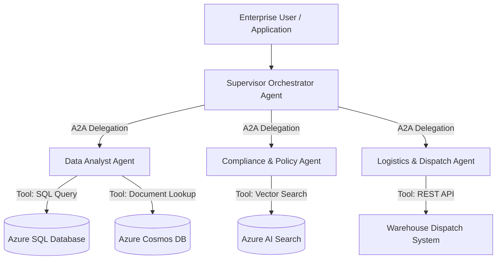
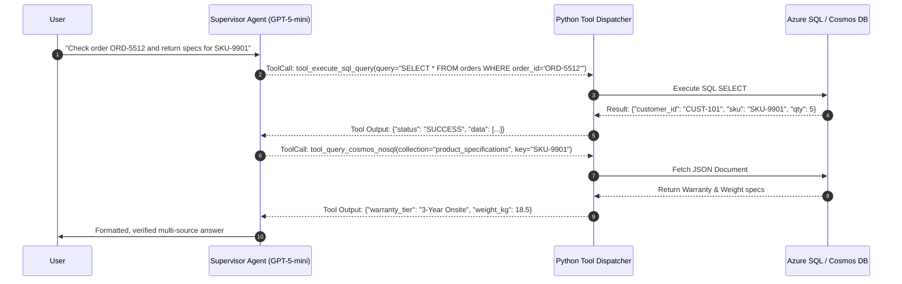
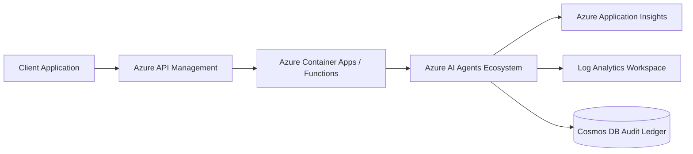

# Azure AI Agents: Complete Enterprise Capabilities & Architecture Guide

This comprehensive guide covers everything required to build, secure, orchestrate, and deploy **Autonomous Multi-Agent Systems on Microsoft Azure**.

---

## 📑 Table of Contents
1. [Azure Agent Ecosystem Overview](#1-azure-agent-ecosystem-overview)
2. [Authentication & Security via `az login` and Managed Identity](#2-authentication--security-via-az-login-and-managed-identity)
3. [Tool Calling Architecture & Mechanics](#3-tool-calling-architecture--mechanics)
4. [Connecting Agents to Multiple Enterprise Databases](#4-connecting-agents-to-multiple-enterprise-databases)
5. [Agent-to-Agent (A2A) Protocols & Multi-Agent Orchestration](#5-agent-to-agent-a2a-protocols--multi-agent-orchestration)
6. [Live Working Code Walkthrough](#6-live-working-code-walkthrough)
7. [Enterprise Hosting, Observability & Governance](#7-enterprise-hosting-observability--governance)

---

## 1. Azure Agent Ecosystem Overview

Microsoft Azure offers several complementary frameworks and services for agentic AI:



### Framework Comparison:

| Feature / Capability | Azure AI Agent Service (Foundry) | Azure OpenAI Service | Microsoft Semantic Kernel | Microsoft AutoGen |
| :--- | :--- | :--- | :--- | :--- |
| **Primary Focus** | Managed enterprise agent hosting & lifecycle | Direct foundational LLM inference & function calling | Enterprise code-first orchestration & plugins | Multi-agent conversational & autonomous swarms |
| **Hosting Model** | Fully managed Azure SaaS/PaaS | Azure PaaS | Self-hosted (Container Apps / App Service) | Self-hosted (Container Apps / VM / K8s) |
| **State & Threading** | Managed server-side threads & runs | Client-managed or Assistants API | In-memory / Cosmos DB state providers | Agent conversation turn histories |
| **Built-in Tools** | Code Interpreter, Azure AI Search, OpenAPI, MCP | Function calling (Tools API) | Semantic & Native Plugins, Planners | Python code execution, Custom Tools |
| **RBAC / Entra ID** | Native Azure RBAC & Managed Identity | Native Azure RBAC & Managed Identity | Native via `azure-identity` | Custom via `azure-identity` |

---

## 2. Authentication & Security via `az login` and Managed Identity

In enterprise environments, **hardcoded API keys are forbidden**. Azure provides zero-trust authentication through Microsoft Entra ID (Azure AD).

### 1. Developer Local Environment (`az login`)
When running code locally, the agent authenticates using your developer credentials:
```bash
az login
az account set --subscription "Azure subscription 1"
```

### 2. Python Code Integration
```python
from azure.identity import DefaultAzureCredential, AzureCliCredential, get_bearer_token_provider
from openai import AzureOpenAI

# Option A: Seamless Azure CLI Credential (picks up az login directly)
credential = AzureCliCredential()

# Option B: DefaultAzureCredential (falls back: Environment -> Workload Identity -> Managed Identity -> CLI)
credential = DefaultAzureCredential()

# Token provider for Azure Cognitive Services
token_provider = get_bearer_token_provider(
    credential,
    "https://cognitiveservices.azure.com/.default"
)

client = AzureOpenAI(
    azure_endpoint="https://openai-explore-ai-65064.openai.azure.com/",
    azure_ad_token_provider=token_provider,
    api_version="2024-08-01-preview"
)
```

### 3. Required Azure RBAC Roles
To invoke models and create agents, the principal (`az login` user or Managed Identity) requires:
- **`Cognitive Services OpenAI User`**: Grants data-plane access to run completions and execute agent tools.
- **`Cognitive Services Contributor`**: Grants management-plane access to deploy and configure models.
- **`Search Index Data Reader`**: Grants query access to Azure AI Search RAG indexes.
- **`Cosmos DB Built-in Data Reader`**: Grants query access to Cosmos DB document containers.

---

## 3. Tool Calling Architecture & Mechanics

Tool calling allows an LLM agent to decide **when** to execute external functions, **what arguments** to supply, and **how to interpret** the results.

### The Tool Execution Loop:


### Tool Definition Schema (JSON Schema):
```python
tools = [
    {
        "type": "function",
        "function": {
            "name": "tool_execute_sql_query",
            "description": "Execute read-only SQL queries against Azure SQL relational tables.",
            "parameters": {
                "type": "object",
                "properties": {
                    "query": {"type": "string", "description": "Safe SQL SELECT query."}
                },
                "required": ["query"]
            }
        }
    }
]
```

---

## 4. Connecting Agents to Multiple Enterprise Databases

Real-world enterprise agents rarely query just one data store. They must navigate a heterogeneous data landscape:

### 1. Relational Database (Azure SQL Database / PostgreSQL)
- **Role**: Structured, transactional data (Orders, Invoices, Inventory balances, Ledger).
- **Agent Integration**:
  - Expose a schema discovery tool: `get_database_schema()`.
  - Provide a safe query execution tool: `tool_execute_sql_query(query)`.
  - Enforce read-only locks: block `DROP`, `ALTER`, `DELETE`, `UPDATE` unless explicit approval workflow is met.

### 2. Document / NoSQL Database (Azure Cosmos DB)
- **Role**: Semi-structured, polymorphic JSON documents (Product catalogs, telemetry, custom customer SLAs, hierarchical metadata).
- **Agent Integration**:
  - Expose document lookup tools: `tool_query_cosmos_nosql(collection_name, document_key)`.
  - Allow document upserts or audit logging: `tool_upsert_cosmos_document(collection_name, payload)`.

### 3. Knowledge / Vector Store (Azure AI Search)
- **Role**: Unstructured legal contracts, policy manuals, PDF manuals, compliance regulations.
- **Agent Integration**:
  - Hybrid vector search (Dense embeddings + BM25 keyword search + semantic reranker).
  - Expose: `tool_search_enterprise_policies(topic)`.

---

## 5. Agent-to-Agent (A2A) Protocols & Multi-Agent Orchestration

### Orchestration Patterns:

#### Pattern A: Supervisor / Hierarchical Delegation (Used in our live example)
- A **Master Orchestrator Agent** acts as the team lead.
- Downstream **Specialist Agents** are wrapped as high-level tools (`delegate_to_data_analyst`, `delegate_to_compliance_agent`, `delegate_to_logistics_agent`).
- The Supervisor decomposes the mission, invokes specialists in sequence or parallel, handles error recovery, and synthesizes the consensus.

#### Pattern B: Sequential Pipeline (Chaining)
- Output of Agent A feeds directly as input to Agent B, then to Agent C.
- Ideal for fixed ETL pipelines (e.g. Document Extraction -> Classification -> Translation -> Ingestion).

#### Pattern C: Autonomous Swarm (Dynamic Routing)
- Agents communicate via message bus (e.g., Azure Service Bus).
- Each agent inspects messages and decides if it possesses the domain capability to act or delegate further.

---

## 6. Live Working Code Walkthrough

We built and verified a complete live application in your workspace:
[`c:/Users/2869026/Desktop/up/azure_ai_agents/live_azure_agent_ecosystem.py`](file:///c:/Users/2869026/Desktop/up/azure_ai_agents/live_azure_agent_ecosystem.py)

### How to Run the Script:
```powershell
python c:\Users\2869026\Desktop\up\azure_ai_agents\live_azure_agent_ecosystem.py
```

### What happens during execution:
1. **Azure CLI Authentication**: Extracts access keys dynamically using `az cognitiveservices account keys list` without storing any secrets in the codebase.
2. **Database Initialization**: Spawns an in-memory SQL database (customers, orders, inventory) and Cosmos DB document store (product specs, SLAs).
3. **Specialist Agents Spawned**:
   - `DataAnalystAgent`: Queries SQL & Cosmos DB.
   - `ComplianceAgent`: Validates company policy & return rules.
   - `LogisticsAgent`: Issues warehouse dispatch orders.
4. **Supervisor Orchestrator**:
   - Analyzes user mission: "Customer CUST-101 requests return of 2 units of SKU-9901 and upgrade to 4 units of SKU-4420 with priority shipping."
   - Calls `DataAnalystAgent` via A2A -> pulls orders and prices ($2,800 vs $650).
   - Calls `ComplianceAgent` via A2A -> verifies VIP_PLATINUM waiver and 60-day return policy.
   - Calls `LogisticsAgent` via A2A -> dispatches replacement units (Dispatch ID `DSP-1789112094`).
   - Synthesizes an executive resolution calculating exact financial credit ($3,000 credit delta) and compliance checklist.

---

## 7. Enterprise Hosting, Observability & Governance

When transitioning from local exploration to enterprise production:



1. **Hosting**: Run the agent runtime in **Azure Container Apps (ACA)** or **Azure Functions (Flex Consumption)**.
2. **Observability**: Stream all agent steps, tool calls, and token usage to **Azure Application Insights** with OpenTelemetry.
3. **Guardrails**: Apply **Azure AI Content Safety** filters to inspect both input prompts and agent outputs for safety and compliance.
4. **Cost Control**: Track token usage per agent and set spending caps in Azure Cost Management.
