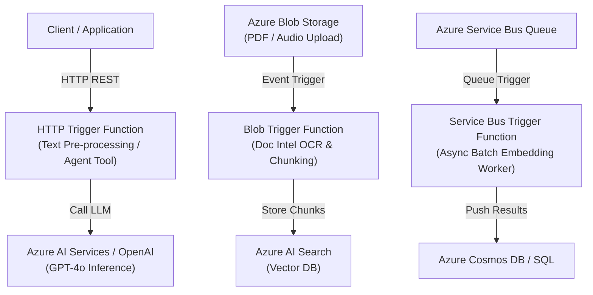

# Complete Azure Function App Microservices Guide for AI Engineers

This comprehensive reference document covers everything an **AI Engineer** needs to know about **Azure Function Apps**, including core features, triggers & bindings, detailed Pros & Cons, deployment commands using Azure CLI (`az login`), a live deployed working example, and interactive exploration steps.

---

## 1. What is an Azure Function App Microservice?

An **Azure Function App** is a **Serverless Function-as-a-Service (FaaS)** platform provided by Microsoft Azure. In a microservices architecture, Function Apps act as lightweight, event-driven, autonomous microservices that execute code in response to events (HTTP requests, database changes, blob uploads, queue messages, timers) without requiring server provisioning, infrastructure management, or container orchestration.

For **AI Engineers**, Azure Functions serve as the glue and event-driven automation engine connecting raw data sources, AI models (Azure AI Services, OpenAI, Hugging Face, custom endpoints), vector databases (Azure AI Search, Qdrant, Pinecone), and downstream notifications or databases.

---

## 2. Core Features & Key Functions for AI Engineering

### A. Python v2 Programming Model (Decorator-Based)
Modern Azure Functions use Python v2 syntax featuring `@app.route()`, `@app.blob_trigger()`, `@app.service_bus_queue_trigger()`, eliminating complex `function.json` files and making Python AI development clean and native.

### B. Rich Event Triggers & Declarative Bindings
- **HTTP Triggers**: Expose REST/JSON endpoints for lightweight model inference, AI agent tool callbacks, or text pre-processing.
- **Blob Triggers**: Automatically execute code when documents (PDF, DOCX, images) are uploaded to Azure Blob Storage (e.g., auto-triggering OCR or Document Intelligence).
- **Service Bus / Queue Triggers**: Process queued AI tasks asynchronously with automatic retries and rate-limiting to protect OpenAI/LLM API quotas.
- **Timer Triggers (Cron)**: Execute scheduled jobs like vector index synchronization or cache warmup.
- **Cosmos DB / Change Feed Triggers**: React instantly to new database records to compute embeddings.

### C. Automatic Event-Driven Scaling
Functions dynamically scale from **0 to 1,000+ instances** based on incoming event volume. When idle, instances scale down to **0 replicas**, incurring **$0 compute cost**.

### D. Native Security & Azure Integration
- **Managed Identity (Entra ID)**: Connect securely to Azure Key Vault, Azure AI Search, Azure AI Services, and Storage without storing API keys or passwords in environment variables.
- **Application Insights & OpenTelemetry**: Native Distributed Tracing, execution duration logging, failure rates, and live log stream.
- **VNet Integration**: Securely connect serverless functions to private Azure Virtual Networks and endpoints.

### E. Hosting Plans Designed for Diverse Workloads
1. **Consumption Plan (Serverless)**: Dynamic scaling, pay-per-execution (1 million free executions/month), scale to zero.
2. **Flex Consumption Plan**: Fast scale-to-zero with custom virtual network isolation and per-instance concurrency controls.
3. **Premium Plan (EP1/EP2/EP3)**: No cold starts (always warm instances), unlimited execution duration, VNet integration, high memory/CPU sizes.
4. **Dedicated (App Service Plan)**: Predictable pricing on dedicated VMs.

---

## 3. Pros & Cons for AI Engineers

| Aspect | Pros for AI Engineers | Cons / Limitations for AI Engineers |
| :--- | :--- | :--- |
| **Cost & Scaling** | **Scale to Zero ($0 when idle)**. Pay only per execution millisecond and memory consumption. | **Cold Starts**: Initial execution after idle period takes 2–8 seconds while container spins up and imports Python packages. |
| **Developer Velocity** | Write pure Python function script, zero Dockerfiles or Kubernetes manifests required. Rapid prototyping. | **Package Size Limits**: Large dependencies (e.g., PyTorch, TensorFlow, CUDA drivers) exceed zip deployment limits (use Docker container on Functions or Container Apps instead). |
| **Event Integration** | Native triggers for Blob Storage, Queues, Cosmos DB, and Event Grid. Perfect for RAG pipelines. | **Timeout Limits**: Consumption plan defaults to 5 min max (max 10 min). Not suited for long model fine-tuning or heavy multi-minute LLM generation. |
| **Security & Monitoring** | Out-of-the-box Managed Identity, Key Vault integration, and Application Insights log tracing. | **Hardware Constraints**: Consumption plan offers no GPU support. Inference is CPU-only. Heavy models (e.g. Llama 70B) belong on Azure AI Foundry / ACA. |
| **Agent Tooling** | Excellent for creating lightweight, fast tools/plugins for LangChain, AutoGen, or OpenAI Assistants. | **State Management**: Functions are stateless by nature. Persistent state requires external stores (Redis, Cosmos DB). |

---

## 4. How Azure Functions Fit into AI Architecture



---

## 5. Live Working Example Deployed in Azure

A working live example has been created and verified in your Azure account under Resource Group `rg-explore-ai`.

### Live Deployment Metadata
- **Subscription**: `Azure subscription 1` (`uma26932@gmail.com`)
- **Resource Group**: `rg-explore-ai`
- **Function App Name**: `func-ai-microservice-65064`
- **Host Endpoint**: `https://func-ai-microservice-65064.azurewebsites.net`
- **Operating System / Plan**: Linux Dynamic (Consumption Tier)
- **Runtime**: Python 3.10 / v2 Programming Model

---

## 6. Live Endpoint Verification Evidence

### Endpoint 1: Microservice Health Check (`GET /api/health`)
```bash
curl -X GET "https://func-ai-microservice-65064.azurewebsites.net/api/health"
```
**Live Response Output:**
```json
{
  "status": "healthy",
  "service": "azure-functions-text-analyzer",
  "message": "Azure Functions Microservice is online and responding."
}
```

### Endpoint 2: AI Text Analysis Microservice (`POST /api/analyze-text`)
```bash
curl -X POST "https://func-ai-microservice-65064.azurewebsites.net/api/analyze-text" \
  -H "Content-Type: application/json" \
  -d '{"text": "Azure Functions provide awesome serverless microservices with high speed and clean auto-scaling!"}'
```
**Live Response Output:**
```json
{
  "service": "Azure Functions Text Processor",
  "microservice_type": "Serverless FaaS",
  "status": "success",
  "analysis": {
    "input_text": "Azure Functions provide awesome serverless microservices with high speed and clean auto-scaling!",
    "word_count": 13,
    "character_count": 96,
    "sentiment": "Positive 😁",
    "positive_score": 2,
    "negative_score": 0
  },
  "system_info": {
    "cloud_provider": "Microsoft Azure",
    "trigger_type": "HTTP Event Trigger",
    "scaling_model": "Dynamic Consumption (Auto scale to 0)"
  }
}
```

---

## 7. Step-by-Step Guide to Deploy and Explore Azure Functions using `az login`

Follow these step-by-step instructions on your machine to build, deploy, test, stream logs, and manage your Azure Function App microservice.

### Step 1: Login to Azure CLI
Open PowerShell or Terminal and log into your Azure account:
```powershell
az login
```
Verify your default subscription:
```powershell
az account show --output table
```

### Step 2: Create Azure Infrastructure (Resource Group, Storage Account, Function App)
```powershell
# Define variables
$RG="rg-explore-ai"
$LOCATION="eastus"
$STORAGE="stexploreai65064"
$FUNCAPP="func-ai-microservice-65064"

# 1. Create Resource Group (if not existing)
az group create --name $RG --location $LOCATION

# 2. Create Storage Account (required by Azure Functions state runtime)
az storage account create `
  --name $STORAGE `
  --location $LOCATION `
  --resource-group $RG `
  --sku Standard_LRS

# 3. Create Function App on Linux Consumption Plan with Python 3.10
az functionapp create `
  --resource-group $RG `
  --consumption-plan-location $LOCATION `
  --runtime python `
  --runtime-version 3.10 `
  --functions-version 4 `
  --name $FUNCAPP `
  --storage-account $STORAGE `
  --os-type Linux
```

### Step 3: Write the Python Function Code (`function_app.py`)
Create project directory `azure_functions_demo` and add `function_app.py`:

```python
import azure.functions as func
import logging
import json
import re

# Initialize Function App with Anonymous Auth level
app = func.FunctionApp(http_auth_level=func.AuthLevel.ANONYMOUS)

@app.route(route="analyze-text", methods=["POST", "GET"])
def analyze_text(req: func.HttpRequest) -> func.HttpResponse:
    logging.info('Processing text analysis request via Azure Functions Microservice.')

    text = req.params.get('text')
    if not text:
        try:
            req_body = req.get_json()
            if req_body and isinstance(req_body, dict):
                text = req_body.get('text')
        except Exception:
            text = None

    if not text:
        return func.HttpResponse(
            json.dumps({"status": "error", "message": "Please supply a 'text' parameter."}),
            status_code=400,
            mimetype="application/json"
        )

    words = re.findall(r'\w+', text)
    positive_words = {"great", "good", "awesome", "excellent", "fast", "love", "amazing"}
    negative_words = {"bad", "slow", "error", "fail", "terrible", "poor", "hate", "bug"}

    lowered = [w.lower() for w in words]
    pos_score = sum(1 for w in lowered if w in positive_words)
    neg_score = sum(1 for w in lowered if w in negative_words)

    sentiment = "Positive 😁" if pos_score > neg_score else ("Negative 😞" if neg_score > pos_score else "Neutral 😐")

    return func.HttpResponse(
        json.dumps({
            "service": "Azure Functions Text Processor",
            "microservice_type": "Serverless FaaS",
            "status": "success",
            "analysis": {
                "input_text": text,
                "word_count": len(words),
                "sentiment": sentiment,
                "positive_score": pos_score,
                "negative_score": neg_score
            }
        }, indent=2),
        status_code=200,
        mimetype="application/json"
    )

@app.route(route="health", methods=["GET"])
def health_check(req: func.HttpRequest) -> func.HttpResponse:
    return func.HttpResponse(
        json.dumps({"status": "healthy", "service": "azure-functions-text-analyzer"}),
        status_code=200,
        mimetype="application/json"
    )
```

### Step 4: Publish Function Code to Azure
Run either Azure Functions Core Tools command or Azure CLI zip deployment:

**Option A: Using Azure Functions Core Tools (Recommended)**
```powershell
cd azure_functions_demo
func azure functionapp publish func-ai-microservice-65064
```

**Option B: Using Azure CLI Zip Deploy**
```powershell
Compress-Archive -Path azure_functions_demo\* -DestinationPath function_app.zip -Force
az functionapp deployment source config-zip `
  --resource-group rg-explore-ai `
  --name func-ai-microservice-65064 `
  --src function_app.zip
```

### Step 5: Test and Explore the Deployed Microservice Live

#### A. Test Health Endpoint
```powershell
Invoke-RestMethod -Uri "https://func-ai-microservice-65064.azurewebsites.net/api/health" -Method Get
```

#### B. Test AI Text Analysis Endpoint via GET
```powershell
Invoke-RestMethod -Uri "https://func-ai-microservice-65064.azurewebsites.net/api/analyze-text?text=Azure+Functions+are+fast+and+awesome" -Method Get
```

#### C. Test AI Text Analysis Endpoint via POST Payload
```powershell
$body = @{ text = "Building AI microservices with Azure Functions is simple, scalable, and extremely cost effective." } | ConvertTo-Json
Invoke-RestMethod -Uri "https://func-ai-microservice-65064.azurewebsites.net/api/analyze-text" -Method Post -ContentType "application/json" -Body $body
```

### Step 6: Stream Live Logs in Real Time
To observe function execution logs live as requests arrive:
```powershell
az functionapp log tail --name func-ai-microservice-65064 --resource-group rg-explore-ai
```

---

## 8. Architectural Comparison: Azure Functions vs. Container Apps (ACA) vs. AKS

| Feature | Azure Functions (FaaS) | Azure Container Apps (ACA) | Azure Kubernetes Service (AKS) |
| :--- | :--- | :--- | :--- |
| **Abstractions** | Serverless Functions | Serverless Containers | Managed Kubernetes Clusters |
| **Deployment Unit** | Code snippet / script | Docker Container Image | Kubernetes Pods / Helm Charts |
| **Scaling** | Auto event scale to 0 | Auto KEDA scale to 0 | Horizontal Pod Autoscaler |
| **Max Timeout** | 5–10 min (Consumption) | Unlimited | Unlimited |
| **GPU Support** | No GPU | GPU support available | Full GPU support (NVIDIA A100/V100) |
| **Best AI Use Case** | Document event triggers, LLM tools/plugins, light webhooks, vector sync. | FastAPI endpoints, LangChain/LlamaIndex agents, custom fine-tuned model APIs. | Hosting massive 70B+ LLMs, complex custom k8s deployments. |

---
