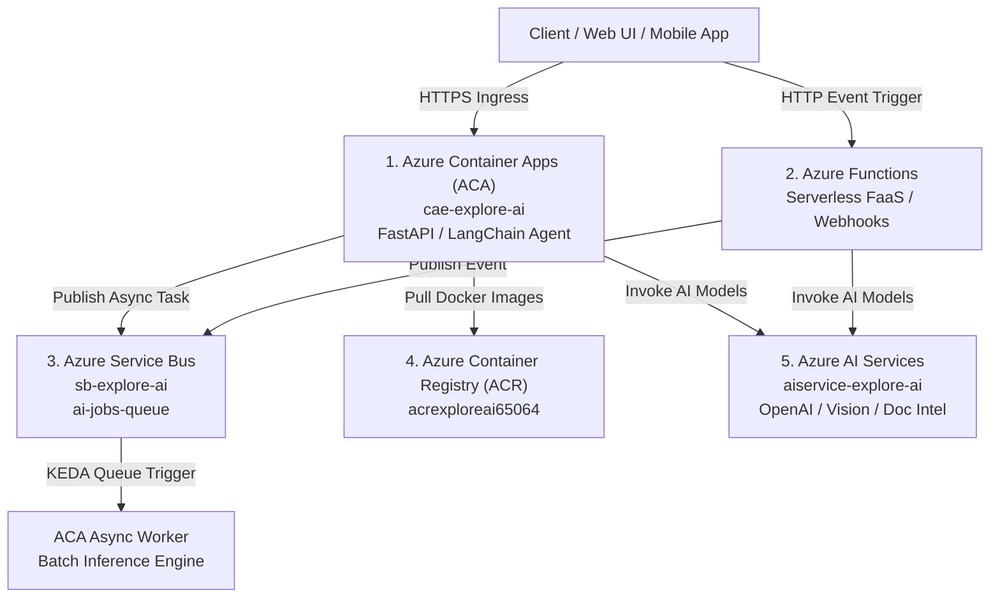

# Azure Microservices Architecture Master Guide for AI Engineers

Welcome to the definitive master reference guide for the core **Azure Microservices** ecosystem provisioned in your `rg-explore-ai` environment. 

This document explains each microservice in simple, intuitive terms with real-world analogies, problem/solution breakdowns, core capabilities, primary AI use cases, and pros/cons.

---

## Ecosystem Architecture Diagram

---

## Microservices Overview Matrix

| Microservice | Resource Name in `rg-explore-ai` | Primary Role | Simple Analogy |
| :--- | :--- | :--- | :--- |
| **1. Azure Container Apps (ACA)** | `cae-explore-ai` / `aca-ai-agent` | Serverless Container Host for AI APIs & Agents | **Apartment Complex for AI Robots** |
| **2. Azure Functions** | `stexploreai65064` (FaaS) | Event-Driven Code Snippets | **Automated Doorbell Sensor** |
| **3. Azure Service Bus** | `sb-explore-ai` / `ai-jobs-queue` | Async Queue & Publish/Subscribe Broker | **Post Office Ticket Queue** |
| **4. Azure Container Registry** | `acrexploreai65064` | Private Docker Image Warehouse | **Secure Lockable Garage for Blueprints** |
| **5. Azure AI Services** | `aiservice-explore-ai` | Multi-Service AI Gateway (LLMs, OCR, Speech) | **Central Super-Brain** |

---

## 1. Azure Container Apps (ACA) — `cae-explore-ai`

### 💡 Simple Explanation (Like a Kid)
Imagine you built a clever AI robot in Python. ACA is a **smart apartment complex** where your robot lives. ACA automatically builds a front door with a public street address (`https://...`), turns off the lights when no guests are visiting ($0 cost), and builds extra identical apartments when 100 guests arrive at the exact same time!

### ❌ What Problem Does It Solve?
- **Without ACA**: You must build and manage an entire Kubernetes (AKS) cluster, set up ingress controllers, manage virtual machine nodes, and write hundreds of lines of complex YAML manifests.
- **With ACA**: You get full Kubernetes power and container flexibility with zero cluster management overhead.

### 🔑 Key Capabilities
- **Scale to Zero (`minReplicas = 0`)**: $0 compute cost when idle.
- **KEDA Event-Driven Autoscaling**: Scales on HTTP concurrency, Service Bus queue length, CPU/RAM, or cron schedules.
- **Traffic Splitting**: Test prompt `v2` on 10% of users while keeping 90% on `v1`.

### ⚖️ Pros & Cons
- **Pros**: Zero K8s cluster management, scale to zero, native Dapr sidecars, any language/Docker image.
- **Cons**: Cold start delay when scaling from 0 to 1 (mitigated by setting `minReplicas = 1`).

---

## 2. Azure Functions — Serverless FaaS (`stexploreai65064`)

### 💡 Simple Explanation (Like a Kid)
Imagine an **automatic doorbell sensor**. You don't pay a guard to sit by the door 24 hours a day. Instead, the moment a package is dropped on the porch (e.g. a PDF uploaded to Blob storage), the sensor wakes up, processes the package in 2 seconds, and immediately goes back to sleep!

### ❌ What Problem Does It Solve?
- **Without Azure Functions**: You would need a web server running 24/7 constantly polling a storage folder every 5 seconds to check if a file was uploaded, wasting continuous compute money.
- **With Azure Functions**: Code runs strictly when triggered by events (HTTP, Blob upload, Service Bus message, Timer) and shuts down immediately after completion.

### 🔑 Key Capabilities
- **Native Event Bindings**: Automatically triggered by Blob storage uploads, Service Bus queues, or Event Grid without writing polling loops.
- **Consumption Billing**: Millions of free executions per month; pay only per millisecond of execution time.

### ⚖️ Pros & Cons
- **Pros**: Zero infra management, ultra-cheap for event-driven tasks, instant event triggers.
- **Cons**: Default 5-minute timeout per execution; not designed for long-running heavy AI model training.

---

## 3. Azure Service Bus — `sb-explore-ai` (`ai-jobs-queue`)

### 💡 Simple Explanation (Like a Kid)
Imagine a **busy bakery ticket counter**. 50 customers arrive at once asking for custom birthday cakes (heavy AI processing). Instead of the baker trying to bake 50 cakes at the exact same second and burning down the oven (server crash), the ticket machine gives every customer a ticket (`Queue Message`) and processes them one by one safely!

### ❌ What Problem Does It Solve?
- **Without Service Bus**: When 100 users submit 50-page PDFs for AI summarization at once, your HTTP server gets overloaded, times out, crashes, and drops customer requests.
- **With Service Bus**: The HTTP API returns `202 Accepted` immediately with a ticket ID, pushes the job to `ai-jobs-queue`, and background workers process jobs safely at their own pace.

### 🔑 Key Capabilities
- **Queues (Point-to-Point)**: Decouple producers from consumers.
- **Topics & Subscriptions (Pub/Sub)**: Publish one event (e.g. `document-uploaded`) and simultaneously trigger Summarization, Embedding Indexing, and Notification services.
- **Dead-Letter Queue (DLQ)**: Automatically catches and holds failed AI jobs for debugging without losing data.

### ⚖️ Pros & Cons
- **Pros**: Guarantees zero message loss, rate-limits downstream OpenAI API quotas, built-in retry policies.
- **Cons**: Message payload size limit (256 KB standard; use Blob URLs for large PDFs).

---

## 4. Azure Container Registry (ACR) — `acrexploreai65064`

### 💡 Simple Explanation (Like a Kid)
Imagine a **super-secure locked garage** where you store all the master blueprints (`Docker Images`) for your AI robots. When ACA needs to build a new robot apartment, it unlocks the garage, pulls the blueprint (`acrexploreai65064.azurecr.io/my-agent:v1`), and builds it!

### ❌ What Problem Does It Solve?
- **Without ACR**: You would have to publish your private AI application code and proprietary models to public registries (like Docker Hub), risking IP theft and security breaches.
- **With ACR**: A private, enterprise-secured registry protected inside your Azure subscription with Azure Active Directory (Entra ID) authentication.

### 🔑 Key Capabilities
- **Private OCI Artifact Storage**: Store Docker container images, Helm charts, and ML artifacts.
- **Vulnerability Scanning**: Automatically scans container layers for security vulnerabilities.
- **Geo-Replication**: Replicate images across global Azure regions automatically.

### ⚖️ Pros & Cons
- **Pros**: Enterprise security, fast image pull speeds within Azure VNet, native integration with ACA & AKS.
- **Cons**: Storage costs accrue if old unused container tags are not cleaned up periodically.

---

## 5. Azure AI Services — `aiservice-explore-ai`

### 💡 Simple Explanation (Like a Kid)
Imagine a **universal Super-Brain API**. Instead of building your own massive brain from scratch (which costs millions of dollars), you plug into Azure's pre-trained Super-Brain. You can ask it to read scanned handwriting (Document Intelligence), look at pictures (Computer Vision), or reason through complex problems (Azure OpenAI GPT-4o)!

### ❌ What Problem Does It Solve?
- **Without Azure AI Services**: You would need expensive GPU hardware, months of data collection, and ML engineers to train foundational vision, OCR, and language models.
- **With Azure AI Services**: Instant REST API & Python SDK access to state-of-the-art enterprise AI models.

### 🔑 Key Capabilities
- **Multi-Service Access**: Single endpoint & API key accessing OpenAI (GPT-4o, Embeddings), Vision, Document Intelligence, Speech, and Translator.
- **Enterprise Data Privacy**: Prompts and customer data are **NEVER** used to train foundation models.

### ⚖️ Pros & Cons
- **Pros**: Zero model training needed, enterprise SLA, strict data privacy compliance.
- **Cons**: Subject to API rate limits (TPM/RPM) requiring quota management for high-throughput apps.

---
