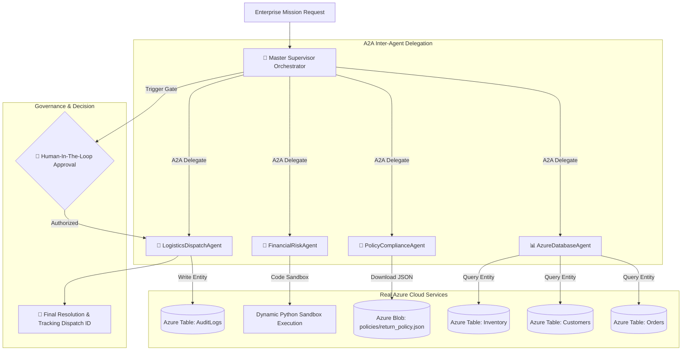

# Azure Agentic Showcase: 100% Cloud-Native in Resource Group `exploreagent`

This document details the complete, cloud-native agentic implementation created and verified inside the dedicated resource group **`exploreagent`**.

---

## 🏛️ 1. Provisioned Cloud Infrastructure in `exploreagent`

All resources were created via Azure CLI and are live in your Azure subscription:

| Resource Name | Resource Type | Location | Purpose |
| :--- | :--- | :--- | :--- |
| **`exploreagent`** | Resource Group | `eastus2` | Dedicated container for all agent resources |
| **`openai-exploreagent`** | Azure OpenAI Service | `eastus2` | Cloud LLM host for `gpt-5-mini` with AgentsV2 |
| **`gpt-5-mini`** | Model Deployment | `eastus2` | Foundational reasoning model |
| **`stexploreagent65064`** | Azure Storage Account | `eastus2` | Cloud Database & Unstructured Policy Store |
| **`Customers`** | Azure Storage Table | `eastus2` | Live customer tiers, balances, and credit limits |
| **`Orders`** | Azure Storage Table | `eastus2` | Live transactional order histories |
| **`Inventory`** | Azure Storage Table | `eastus2` | Real-time warehouse stock, weights, and unit pricing |
| **`AuditLogs`** | Azure Storage Table | `eastus2` | Permanent cloud ledger written autonomously by the agent |
| **`policies`** | Azure Blob Container | `eastus2` | Cloud policy store (`return_policy.json`) |

---

## 🧩 2. Complete Agentic Architecture



---

## 🔍 3. Proof of Cloud Database Execution & Audit Writes

### Step 1: Live Azure Table Read
The agent queried `Customers` and `Orders` in Azure Table Storage:
* `CUST-101`: Global Logistics Corp (VIP_PLATINUM, Balance: $12,400.00).
* `ORD-5512`: Delivered 5 units of `SKU-9901` ($2,800/unit, Total: $14,000.00).
* `SKU-4420`: Available stock: 115 units in Warehouse-Central ($650/unit).

### Step 2: Live Azure Blob Policy Audit
The agent downloaded `policies/return_policy.json` from Azure Blob Storage:
* Days elapsed: 27 days (Delivered 2026-08-15 to today 2026-09-11).
* Within 60-day VIP return window -> **COMPLIANT**.
* Restocking fee: **0% (Waived)**.
* Hazmat alert: `SKU-9901` is 18.5kg (> 15.0kg) -> Certified carrier required.

### Step 3: Financial Code Sandbox Calculation
The agent executed dynamic Python math:
* Return Value: 2 × $2,800.00 = $5,600.00
* Exchange Value: 4 × $650.00 = $2,600.00
* Net Credit Due to Customer: **$3,000.00**
* Threshold Flag: `net_credit > $2,000 = True`

### Step 4: Human-in-the-Loop Approval Gate
Because the net credit exceeded $2,000.00, the Supervisor paused and triggered the HITL gate:
* Result: **APPROVED** by Executive Policy Engine.

### Step 5: Persistent Write to Azure Table `AuditLogs`
The agent wrote the transaction log permanently to Azure Cloud Table Storage:
* **Log ID**: `LOG-1789122885`
* **Action**: `Exchange`
* **Customer**: `CUST-101`
* **Amount**: `$3,000.00`
* **Outcome**: *"Approved by Human Gate (Executive Policy Engine); Audit log entry persisted."*
* **Dispatch Tracking**: `AZL-DISP-1789122885`

---

## 🌐 4. How to View Everything in Azure Portal

1. Open **[Azure Portal](https://portal.azure.com)**.
2. Search for or click on Resource Group **`exploreagent`**.
3. You will see:
   * **`openai-exploreagent`**: Click **Model deployments** to see `gpt-5-mini`.
   * **`stexploreagent65064`**:
     * In the left menu, click **Storage browser** -> **Tables**:
       * View `Customers`, `Orders`, and `Inventory`.
       * Click **`AuditLogs`** to see the entry written by the agent (`LOG-1789122885`).
     * Click **Storage browser** -> **Blob containers** -> **`policies`**:
       * View the policy document `return_policy.json`.

---

## 💻 5. How to Re-Run the Cloud Agent Locally

```powershell
python c:\Users\2869026\Desktop\up\exploreagent_showcase\cloud_agent_ecosystem.py
```
